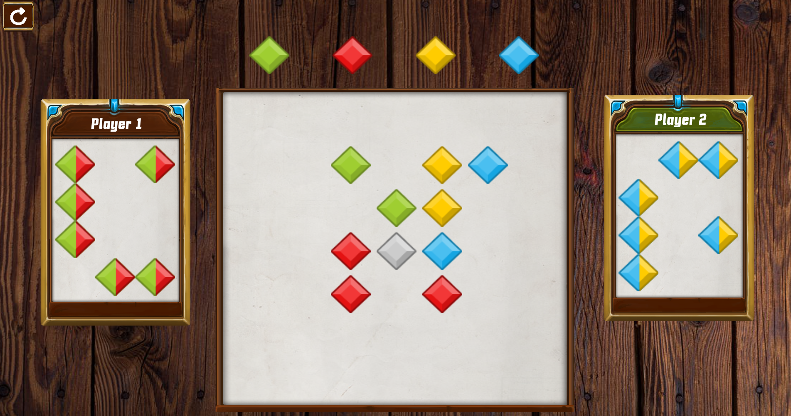
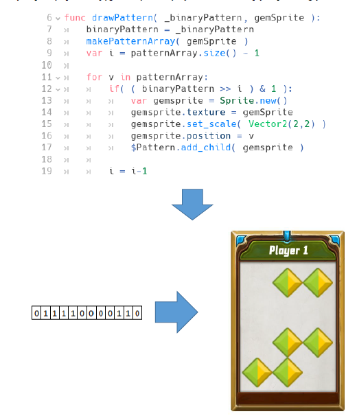
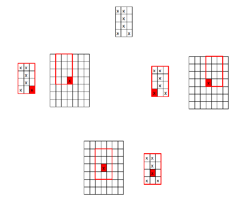

# MagicGemsGame
Magic Gems Game is a board/card game made with GODOT 3.0.6
I made this game for my engineering diploma

The biggest challenge was to make a separate search for player pattern on common board. I made this by saving the card as a binary array with 1 for a right color and 0 for anything else and search the whole board around the white stone sice it had to be part of a player shape on a card.

 

